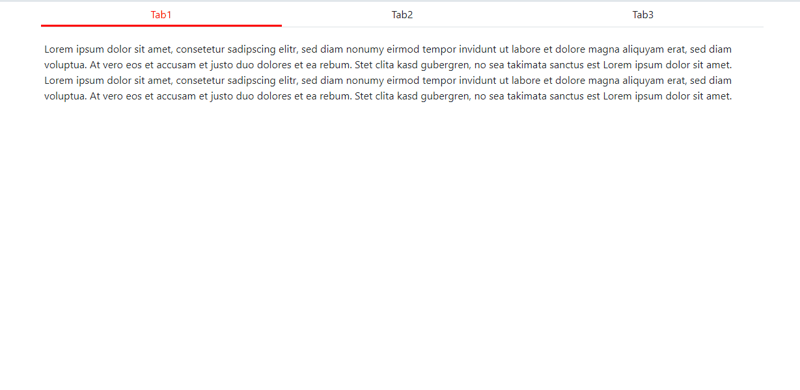

# H2 Invent Material Design Tabs
This Package installs a great looking material Tabs element.
it is inspired by google material dign guide and some more google applications.
The underline is realy moving between the tabs and the tab content is scroling in the right direction.

Installation:

`npm i h2-invent-material-tabs`

Add in you main css:

`@import '~h2-invent-material-tabs/css/material-tabs.css';`

in your main js:

`import {initTabs} from 'h2-invent-material-tabs';`
init the tabs with 

``initTabs('<classWhich sorounds the tabs>')``

see the /dist/demo.html how it looks and how to integrate it.

